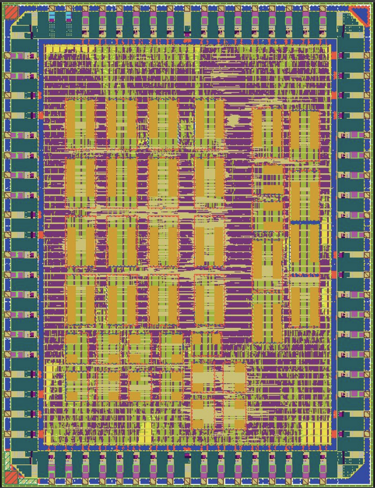

# Custom ASIC for Keyword Spotting

This repository presents the RTL design and verification of a complete keyword spotting (KWS) digital signal
processing pipeline for a GF180MCU ASIC implementation. The audio pre-processing converts a 1.003 MHz PDM microphone
bit-stream to 16 kHz PCM 16 bit mono audio using a five-stage CIC decimator followed by a 33-tap compensation FIR
filter to correct pass-band droop and gain produced by the CIC filter. Time-frequency analysis is performed by a
256-point pipelined Short-time FFT that generates complex frequency bins and frames, which are transformed into a
Log-Mel Spectrogram through a filter-bank and logarithmic compression; then fed into a DS-CNN. The classification
core implements a depthwise-separable Convolutional neural network with int8 quantization, featuring a custom
accelerator with shared MAC array, re-quantization logic, and 29 KB of on-chip SRAM for weights and feature maps.
Verification employs a bit-accurate Python reference model and Cocotb testbenches, with system-level validation
confirming correct pipeline operation through .wav file comparsion of RTL and Golden Model.



## Simulation & Verification

### Dependencies
```bash
pip install cocotb==1.9.2 cocotb-test==0.2.6 pytest==9.0.2 numpy torchaudio gitpython myhdl
```

System dependencies:
- Python 3.10+
- Icarus Verilog 11.0 - `sudo apt-get install iverilog` (Ubuntu/Debian)
- Verilator (optional, for lint and verilator-based simulation) - `sudo apt-get install verilator`
- GTKWave (optional, for waveform viewing) - `sudo apt-get install gtkwave`

### Repository Structure
```
src/
├── ml/                              # machine learning
│   ├── Pipeline/                    # training scripts and Python reference model
│   └── models/                      # trained model checkpoints
│
└── rtl/                             # synthesizable RTL
    ├── CIC/                         # CIC decimation filter IP
    ├── FIR/                         # FIR directory
    │   ├── rtl/                     # FIR compensation/anti-aliasing filter
    │   ├── tests/                   # FIR testbench
    │   └── scripts/                 # FIR filter coefficients and verilog generator    
    ├── STFFT/                       # STFFT directory
    │   ├── R2FFT/
    │   |   ├── hdl/                 # R2FFT ip with custom memory controller
    │   |   └── test/                # R2FFT ip testbenchs and modified 256 point 16 bit R2FFT testbench
    |   ├── scripts/                 # Filter coefficients generators
    |   └── tests/                   # STFFT testbench
    ├── dscnn/                       # DS-CNN inference engine RTL
    │   ├── bias_SRAM/               # Bias memory
    │   ├── feature_sram/            # Feature memory
    │   ├── fsm/                     # CNN controller
    │   ├── kws_top/                 # CNN testbench and helper files
    │   ├── mac_array/               # Multiply Accumalate array
    │   ├── requant/                 # Quantization
    │   ├── spectrogram_sram/        # Spectrogram memory
    │   └── weight_sram/             # Weight memory
    ├── Log-Mel/                     # log-mel filterbank
    │   ├── ip/                      # PULP arithmetic IP cores
    │   ├── data/                    # generated hex files (gitignored)
    │   ├── scripts/                 # mel coefficient generation
    │   └── rtl/
    │       ├── power_calc/          # Power Calculation - Re^2 + Im^2
    │       ├── mac_unit/            # Multiply-Accumulate
    │       ├── mel_filterbank/      # Filterbank
    │       ├── frame_control/       # Data pipeline FSM
    │       ├── log_lut/             # Log2 Compression
    │       ├── output_buffer/       # Mel Bin Output Buffer
    │       └── log_top/             # top-level integration test
    ├── SPECT_BUFFER/                # Spectrogram buffer RTL and testbench
    ├── flash/                       # SRAM loading/boot controller
    └── top/                         # Audio Preprocessing and Feature extraction (pre-CNN) RTL and testbench
        ├── data/                    # Memory files for simulation
        ├── scripts/                 # debugging scripts
        └── speech_data/             # Google speech dataset

```

### Makefile Targets

All modules written by our team share the same Makefile structure with these
targets:

| Target | Description |
|--------|-------------|
| `make lint` | Verilator lint check (design files only) |
| `make test` | Basic iverilog simulation |
| `make test-cocotb` | cocotb testbench with Icarus (default) |
| `make test-cocotb-icarus` | cocotb testbench with Icarus (explicit) |
| `make test-cocotb-verilator` | cocotb testbench with Verilator |
| `make wave` | Open waveform in GTKWave |
| `make clean` | Remove all build artifacts |

---

### Running Testbenches

---

#### Chip Core End-to-End Test

The full-chip core test boots the RTL over UART, drives real audio through the
PDM input path, waits for DS-CNN inference, and checks the class result:
```bash
make sim-core
```

`chip_core_tb.py` reads a `test_vectors.json` manifest to choose the WAV file,
then converts that WAV to PDM and drives it through the actual RTL frontend. It
does not directly drive the generated `spectrogram_*.hex` files; those files are
used by the standalone KWS tests and as golden/reference artifacts from
`generate_spect_full.py`.

To test a specific keyword, first generate a manifest for that keyword:
```bash
cd src/rtl/dscnn/kws_top
python3 generate_spect_full.py \
  --keyword yes \
  --n-samples 10 \
  --ckpt dscnn-32requant-v11/dscnn-32requant-v11.pt \
  --out-dir spectrograms
```

Then run the chip-core test from the repository root, pointing it at that
manifest:
```bash
make sim-core \
  KWS_KEYWORD=yes \
  KWS_MANIFEST_JSON=src/rtl/dscnn/kws_top/spectrograms/test_vectors.json \
  KWS_SAMPLE_INDEX=0
```

Useful selectors:
- `KWS_KEYWORD=yes` restricts selection to manifest samples with that label.
- `KWS_SAMPLE_INDEX=3` selects a specific manifest sample.
- `KWS_SAMPLE_MATCH=0132a06d` selects the first sample whose WAV path or label
  contains that text.
- `KWS_MANIFEST_JSON=...` points the test at a specific generated manifest.

With `make`, pass these as variables (`KWS_KEYWORD=yes`), not as command-line
flags (`--keyword yes`).

---

### Documentation

Per-block documentation lives alongside the RTL in each subdirectory:

| Module | README | Contents |
|--------|--------|----------|
| CIC Decimator | [`rtl/CIC/README.md`](rtl/CIC/README.md) | 3-stage CIC, R=63, 1.008 MHz → 16 kHz, ready/valid interface |
| FIR Compensation | [`rtl/FIR/README.md`](rtl/FIR/README.md) | 33-tap Type-I symmetric CSD-optimized droop correction filter |
| STFFT / R2FFT | [`rtl/STFFT/README.md`](rtl/STFFT/README.md) | Ping-pong single-port R2FFT, ring-buffer STFFT wrapper, Hanning window |
| Pipeline Top | [`rtl/top/README.md`](rtl/top/README.md) | End-to-end integration (PCM and PDM inputs), cocotb tests, VAD test suite, golden model comparison |

#### Log-Mel Filterbank

**Step 1: Generate hex files** (required before any log-mel simulation):
```bash
cd src/rtl/Log-Mel
python3 scripts/mel_coeffs.py
```

This writes to `src/rtl/Log-Mel/data/`:
- `mel_coeffs.hex` - Q0.15 sparse mel filter weights
- `mel_starts.hex` - start bin index per mel filter
- `mel_ends.hex` - end bin index per mel filter
- `log2_lut.hex` - 64-entry log₂ fractional LUT in Q4.12

> The `data/` directory is gitignored. Always run `mel_coeffs.py` after
> cloning before attempting to simulate any log-mel module.

**Step 2: Run individual module tests:**
```bash
cd src/rtl/Log-Mel/rtl/power_calc && make test-cocotb
cd src/rtl/Log-Mel/rtl/mac_unit && make test-cocotb
cd src/rtl/Log-Mel/rtl/output_buffer && make test-cocotb
```

**Step 3: Run top-level integration test:**
```bash
cd src/rtl/Log-Mel/rtl/log_top
make test-cocotb
```

Hex files are symlinked into the simulator working directory automatically, 
no manual setup needed beyond Step 1.

| Test | Module | What it verifies |
|------|--------|-----------------|
| `test_power_basic` | `power_calc` | Known-value re²+im² computation |
| `test_power_negative_inputs` | `power_calc` | Sign handling - squaring produces positive output |
| `test_power_golden` | `power_calc` | 200 random inputs vs numpy golden model |
| `test_mac_single` | `mac_unit` | Single multiply-accumulate |
| `test_mac_accumulate_multiple` | `mac_unit` | Multi-cycle accumulation correctness |
| `test_mac_clear` | `mac_unit` | Accumulator reset between frames |
| `test_mac_golden` | `mac_unit` | 20 random frames vs golden model |
| `test_load_and_drain` | `output_buffer` | Load 40 values, drain in order |
| `test_frame_sent_signal` | `output_buffer` | frame_sent_o pulses exactly once per frame |
| `test_backpressure_alternating` | `output_buffer` | Valid/ready handshake under backpressure |
| `test_two_consecutive_frames` | `output_buffer` | Clean reload between frames |
| `test_logmel_single_frame` | `logmel_top` | End-to-end frame vs torchaudio reference model |
| `test_logmel_two_frames` | `logmel_top` | Multi-frame correctness, MAC clear between frames |
| `test_logmel_cnn_backpressure` | `logmel_top` | End-to-end with random CNN backpressure |

---

### Notes

- Icarus Verilog produces warnings about constant selects in `always_*`
  processes from the PULP IP cores. These are known simulator limitations
  and do not affect correctness: all tests pass despite these warnings.
- The PULP `Log2` IP uses constructs unsupported by Icarus. `log_lut` uses
  a behavioral `` `ifndef SYNTHESIS `` block for simulation and the actual
  IP for synthesis.
- For ASIC synthesis, `$readmemh` initializations must be replaced with
  case-statement ROMs. See `scripts/mel_coeffs.py` for the planned
  case-statement output mode.

## Prerequisites

We use a custom fork of the [gf180mcuD PDK variant](https://github.com/wafer-space/gf180mcu) until all changes have been upstreamed.

To clone the latest PDK version, simply run `make clone-pdk`.

In the next step, install LibreLane by following the Nix-based installation instructions: https://librelane.readthedocs.io/en/latest/installation/nix_installation/index.html

## Implement the Design

This repository contains a Nix flake that provides a shell with the [`leo/gf180mcu`](https://github.com/librelane/librelane/tree/leo/gf180mcu) branch of LibreLane.

Simply run `nix-shell` in the root of this repository.

> [!NOTE]
> Since we are working on a branch of LibreLane, OpenROAD needs to be compiled locally. This will be done automatically by Nix, and the binary will be cached locally. 

With this shell enabled, run the implementation:

```
make librelane
```

## View the Design

After completion, you can view the design using the OpenROAD GUI:

```
make librelane-openroad
```

Or using KLayout:

```
make librelane-klayout
```

## Copying the Design to the Final Folder

To copy your latest run to the `final/` folder in the root directory of the repository, run the following command:

```
make copy-final
```

This will only work if the last run was completed without errors.

## Verification and Simulation

We use [cocotb](https://www.cocotb.org/), a Python-based testbench environment, for the verification of the chip.
The underlying simulator is Icarus Verilog (https://github.com/steveicarus/iverilog).

The testbench is located in `cocotb/chip_top_tb.py`. To run the RTL simulation, run the following command:

```
make sim
```

To run the GL (gate-level) simulation, run the following command:

```
make sim-gl
```

> [!NOTE]
> You need to have the latest implementation of your design in the `final/` folder. After implementing the design, execute 'make copy-final' to copy all necessary files.

In both cases, a waveform file will be generated under `cocotb/sim_build/chip_top.fst`.

```
make sim-view
```

## Precheck

To check whether your design is suitable for manufacturing, run the [gf180mcu-precheck](https://github.com/wafer-space/gf180mcu-precheck) with layout.

## Remote Server `sim-core` Environment

```
cd ~/ML-Audio
deactivate 2>/dev/null || true
unset LD_LIBRARY_PATH
nix develop
```

source venv/bin/activate

```
which vvp
which iverilog
which cocotb-config
python -c "import numpy, scipy, cocotb; print('nix sim env ok')"
```

```
make sim-core KWS_KEYWORD=yes KWS_SAMPLE_INDEX=9
```

```
nix develop --command bash -lc 'unset LD_LIBRARY_PATH; make sim-core KWS_KEYWORD=yes KWS_SAMPLE_INDEX=9'
```


## Tmux Session

```bash
tmux new -s my-session
```

list sessions: 
tmux ls

attach to existing session: 
tmux attach -t my_session 

Openroad command from Desktop (Specific path)
openroad: 
docker run -it --rm   -e DISPLAY=$DISPLAY   -v /tmp/.X11-unix:/tmp/.X11-unix   -v /home/dnocera:/home/dnocera   --entrypoint=bash   openroad/orfs:26Q1-338-g1face8531   -c "/OpenROAD-flow-scripts/tools/install/OpenROAD/bin/openroad -gui -no_init /home/dnocera/librelane_files/load_chip.tcl"
