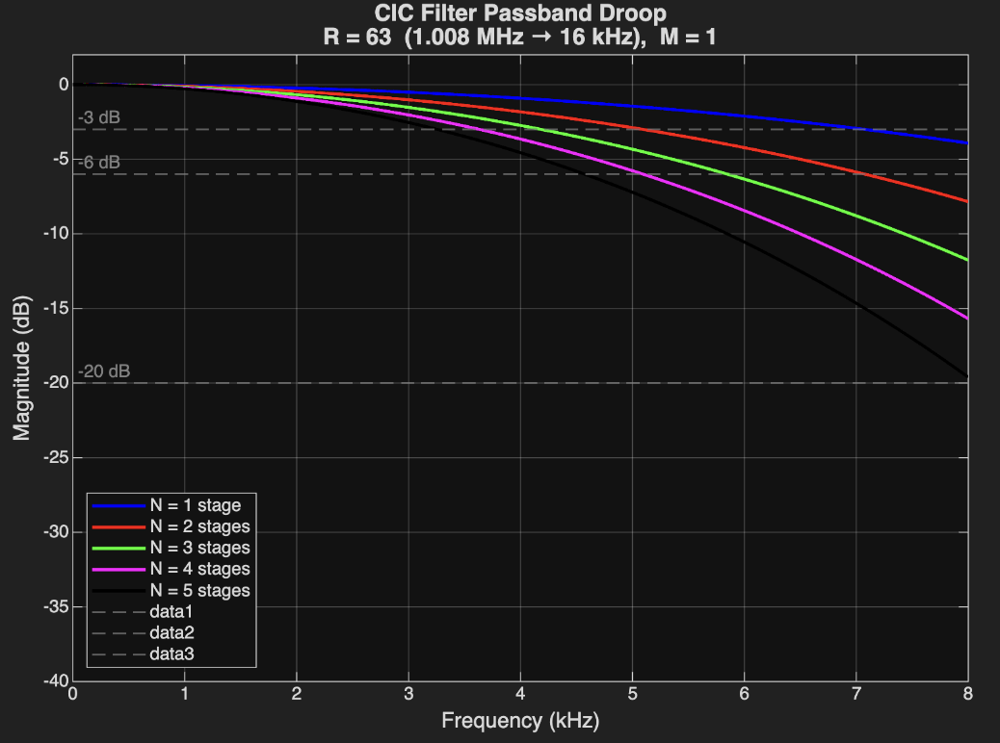

# Type I FIR Compensation Filter

Post PDM to PCM conversion using the CIC filter(an anti-aliasing and decimation filter). It is necessary to have a relatively flat pass-band gain and transition region when fed into a larger system. Due to the pass-band magnitude response of the CIC filter[^1]:

&emsp; &emsp; $\left| H_{CIC}(e^{j2 \pi f}) \right|=\left| \frac{sin(2\pi fD/2)}{sin(2\pi f/2)}\right|^M$

The CIC filter produces a pass-band droop as the frequency increases towards the transition band: 




To achieve a flatter pass-band gain and sharper transition region we can utilize a FIR filter with tap coefficients that contain the inverse magnitude response of the CIC filter. 

## Design Steps[^4][^5]
1. Calculate the inverse magnitude response: \
&emsp; &emsp; $\left| H_{d}(e^{j2 \pi f}) \right|=\left| \frac{sin(2\pi f/2)}{sin(2\pi fD/2)}\right|^M$
2. Compute the impulse responses: \
&emsp; &emsp; $h_d[n]=\frac{1}{2\pi}\int_{0}^{2\pi}H_d(e^{jw})e^{jwn}dw$

3. FIR Approximation via Kaiser Windowing: $h[n]=h_d[n]w[n]$ \
&emsp; &emsp; $h[n] = h_d[n],  0 \leq n \leq N$ \
&emsp; &emsp; $w[n] = \frac{I_0(\beta\sqrt{1-(n-\alpha)^2/\alpha^2})}{I_0(\beta)},  0\leq n\leq N$
 4. Quantization: \
 &emsp; &emsp; Float tap coefficients are quantized to $N_{BITS}$-bit integers 
 5. Canonical Sign Digit Representation Conversion[^2][^3]: \
 &emsp; &emsp; CSD uses a ternary representation of data as a {-1, 0, 1} format, alongside the constraint: no two adjacent digits are non-zero. However, two ‎bits ‎are ‎required ‎to ‎store ‎one ‎digit ‎of a ‎CSD number & requires extra conversion logic for variable CSD multiplication. \
The probability of a CSD bit $C_i$ being non-zero is: \
&emsp; &emsp; $P(|C_{i}|=1) = \frac{1}{3} + \frac{1}{9N}[1-(\frac{1}{2})^{N}]$ \
As N grows larger the probability becomes: $\frac{1}{3}$ \
However for a binary N-bit number the probability becomes: $\frac{1}{2}$ \
**Where the number of shift and addition ‎operations‎ depends on the number of non-zero digits of the multiplicand.**


This design process it achieved through a python script in python script that generates the compensation FIR filter verilog with inputted filter parameters:

| Parameter | Description |
|--------|-------------|
| $f_{in}$ | Input Frequency for CIC  |
| $f_{out}$ | Output Frequency for CIC |
| $f_{N}$ | Nyquist Frequency |
| $R$ | Decimation Rate |
| $N_{CIC}$ | Number of CIC Stages |
| $N_{TAPS}$ | Number of taps |
| $f_{p}$ | Cutoff Frequency/Pass-band Frequency   |
| $N_{BITS}$ | Bit width of Tap Coefficients | 
| $\beta$ | Kaiser Window Shape Parameter |
| $IW$ | Input Bit Width |

## Generating Verilog
To generate Compensation FIR Filter verilog:
```bash
cd scripts
python3 compFIR.py
```
To update/change filter parameters the python script `comp.FIR` must manually be edited

## RTL Testbench
To run cocoTB Compensation FIR Filter testbench:
```bash
cd tests
make test-FIR
```

| Test | Description |
|------|-------------|
| **`test_reset`** | Verifies outputs are zero and valid is de-asserted after reset |
| **`test_ready_signal`** | Checks that `i_tready` correctly stalls upstream when output is valid but downstream isn't ready (`i_tready = !o_tvalid || o_tready`) |
| **`test_impulse_response_axi`** | Sends a single max-amplitude impulse followed by zeros, collects the impulse response, checks if it matches the reference and is symmetric|
| **`test_step_response_axi`** | Checks transient behavior and that steady-state output equals `sum(full_h) × step_val`|
| **`test_random_full_rate_axi`** | 1000 random samples at full throughput while comparing against the reference model |
| **`test_backpressure`** | Toggles `o_tready` every 3 cycles to stress the stall logic; verifies no sample is dropped or duplicated under back-pressure |
| **`test_valid_deasserts`** | Verifies `o_tvalid` goes low after the downstream consumes the output with no new input arriving |


[^1]: Lyons, R. (2020). "A Beginner's Guide To Cascaded Integrator-Comb (CIC) Filters" *https://www.dsprelated.com/showarticle/1337.php*.

[^2]: Rovertson, N. (2017). "Canonic Signed Digit (CSD) Representation of Integers" *https://www.dsprelated.com/showarticle/1030.php*.

[^3]: Arar, S. (2017). "An Introduction to Canonical Signed Digit Representation: CSD is an elegant method to implement digital multipliers in a more efficient way. " *https://www.allaboutcircuits.com/technical-articles/an-introduction-to-canonical-signed-digit-representation/*.

[^4]: Ye, H. (2026). "UCSC ECE 153/250: Digital Signal Processing" *Lecture 14: FIR Filter Design*.

[^5]: Oppenhiem, A. & Schafer. R (2010). "Discrete-Time Signal Processing" *Chapter 7: Filter Design Techniques*.

