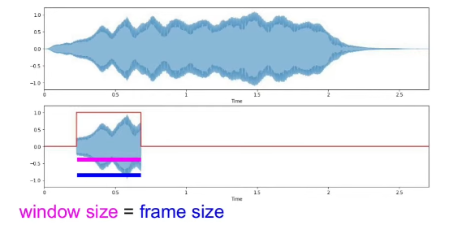
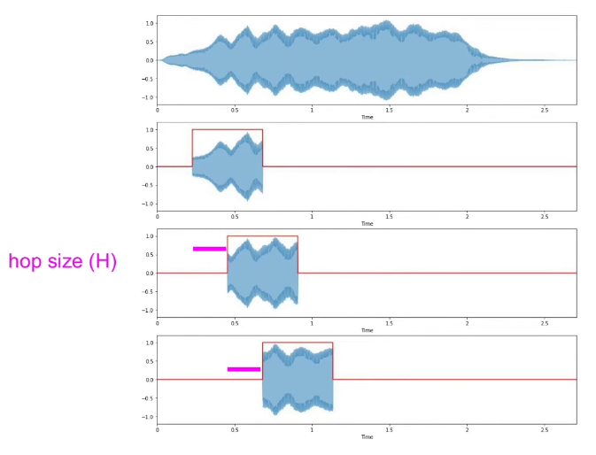

# 256-point Short Time Fast Fourier Transform
The Short Time Fast Fourier Transform is a version of the Discrete Fourier Transform:
&emsp; &emsp; $F(n) = \sum_{k=0}^{N-1}f[k]e^\text{-j*(2pi/N)*nk}$
where instead of computing the computationally expensive DFT, $O(n^2)$, it utilizes the efficient radix-2 Fast Fourier Transform algorithm:  $O(nlogn)$. However, in the case of a human speech, the signal produced is aperiodic and the DFT treats a finite sequence as one period of an implicitly periodic signal.

To solve the issue of transforming an aperiodic signal, the Short Time Fast Fourier Transform must be used. The STFFT is comprised of multiple smaller FFTs that span over a specified sample range instead of a single FFT. This is achieved through a layered windowing system: $h[n]=h_d[n]w[n]$

Now that there is a continuously moving window across an incoming audio input to simulate many smaller FFTs across the signal. We must introduce different forms of measurement for the FFTs range. First we have the window size/frame size(in our case window and frame size are equal). The window size is the sample range of the window function we are going to apply a singular FFT to:
  


Hop size, this is the time or amount of samples before a new window will begin. It is essential to have windows overlapping to prevent aliasing and errors in output(hop size is less than window size):

  

It is important to keep in mind the time-frequency resolution of the STFFTs output. As the frame size increases the frequency resolution increase however the time resolution decreases. Additionally, the hop size dictates how many FFTs are computed in a given audio sound.

## STFFT Overview

- **Authors**: Michael Aguero
- **Architecture**: 256-point SFFT using radix-2 decimation-in-frequecy
- **Input/Output**: 16-bit complex samples (16-bit real and imaginary components)
- **Clock**: 16MHz
- **Processing Time**: 17000 Clock Cycles
- **FFT Size**: 256
- **Window Size**: 256
- **Hop Size**: 128


## 256-point FFT Core IP: R2FFT by yoonisi
This design ulitizes the R2FFT core with a custom memory and butterfly controller:


## Running Testbench

To run the FFT testbench:
```sh
cd R2FFT/test
make test-fft
```

To run the STFFT testbench:
```sh
cd tests
make test-stfft
```
